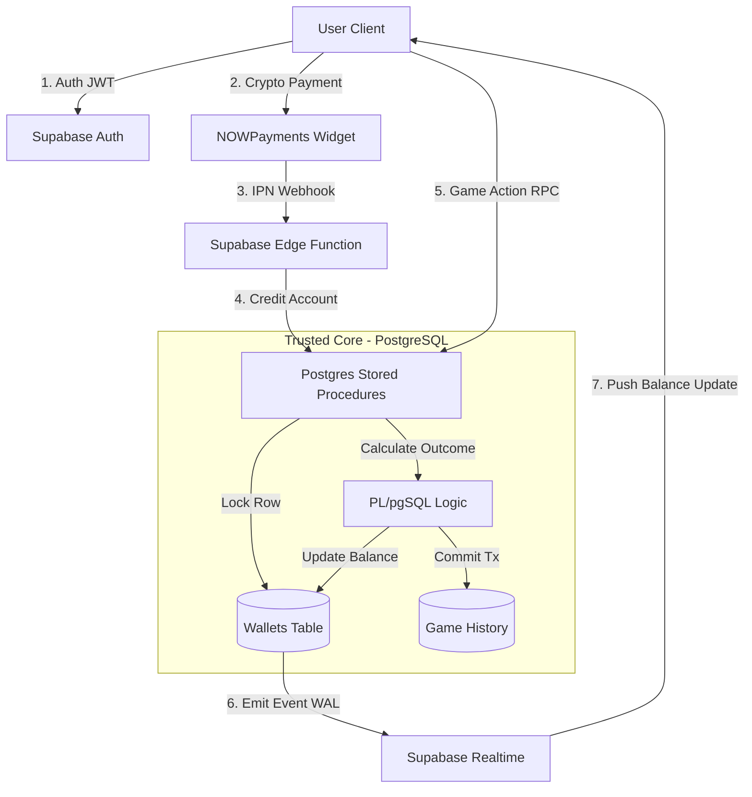

# GGSlots - Distributed Social Casino Architecture

**A high-concurrency, ACID-compliant gaming platform built on PostgreSQL and React.**

> **Architecture Status:** Production Ready (RPC-Only Write Pattern)
> **Deployment Target:** Vercel (Edge Network)
> **License:** MIT

---

## 🏗️ System Architecture

This application strictly follows a **"Zero-Trust Client"** architecture. No business logic regarding balances, game outcomes, or inventory management exists in the frontend JavaScript. The React client acts purely as a presentation layer and a Realtime WebSocket receiver.



---

## 🔰 The "Iron Laws" (Production Rules)

1.  **RPC-Only Mutation**: The frontend is forbidden from calling `UPDATE` or `INSERT` on balance tables. All writes must go through Stored Procedures (Remote Procedure Calls).
2.  **Atomic Transactions**: Every game spin uses `SELECT ... FOR UPDATE` to lock the user's wallet row, preventing race conditions (e.g., double-spending via multi-tabbing).
3.  **Inventory Concurrency**: Limited items (Scratch Cards) use `FOR UPDATE SKIP LOCKED` to ensure two users never buy the same ticket, even under high load.
4.  **Defense-in-Depth**: All database tables have RLS policies enabled. `service_role` keys are never exposed to the client.

---

## 💳 Payments & Economy

### NOWPayments Integration
The platform uses **NOWPayments** for crypto processing (BTC, ETH, USDT, etc.).
1.  **Frontend**: Renders the NOWPayments Iframe Widget configured with specific `iid` (Invoice IDs) for each coin package.
2.  **Backend**: Listens for Instant Payment Notifications (IPN) via Supabase Edge Functions to securely credit user accounts upon confirmed on-chain transactions.

### Currency System
*   **Gold Coins (GC)**: Social currency for entertainment. Cannot be redeemed.
*   **Sweeps Cash (SC)**: Sweepstakes entry tokens. 1.00 SC = $1.00 USD redeemable value.

---

## 💾 Database Schema

The backend logic relies on this specific SQL schema structure (see `supabase/migrations`):

### 1. `profiles`
Extends the internal `auth.users` table.
- `id`: UUID (Primary Key, matches Auth UID)
- `gc_balance`: BigInt (Gold Coins)
- `sc_balance`: BigInt (Sweeps Cash)
- `kyc_status`: Enum (unverified, pending, verified, rejected)

### 2. `game_history` (Immutable Ledger)
A write-only audit trail of every transaction.
- `id`: UUID
- `user_id`: UUID
- `game_type`: Text
- `wager_amount`: BigInt
- `payout_amount`: BigInt
- `outcome_data`: JSONB (Reel positions, card hands, RNG seeds)

---

## 🚀 Deployment & Setup

### 1. Supabase Setup
1.  Create a new Supabase project.
2.  Run the migration script located in `supabase/migrations/schema.sql` in the SQL Editor.
3.  Enable Auth Providers (Email/Password).

### 2. Environment Variables
Configure your Vercel project or local `.env` with:

```bash
VITE_SUPABASE_URL=https://your-project.supabase.co
VITE_SUPABASE_ANON_KEY=your-public-anon-key
```

### 3. Vercel Deployment
1.  Connect your GitHub repository to Vercel.
2.  Add the environment variables from Step 2.
3.  Deploy. The build settings are pre-configured (`npm run build`).

### 4. Verification
Once deployed, the app will strictly attempt to connect to the Supabase instance.
*   **Geo-Blocking**: Access is restricted to US/Canada (excluding banned states like WA, MI, NY).
*   **KYC**: Redemptions require identity verification flow.

---

## 🛠️ Tech Stack

*   **Frontend**: React 18, TypeScript, Vite
*   **UI System**: Tailwind CSS, Lucide React, Glassmorphism
*   **Backend**: Supabase (PostgreSQL 15 + Realtime)
*   **Payments**: NOWPayments API
*   **Compliance**: Built-in Geo-Blocking & KYC state management
